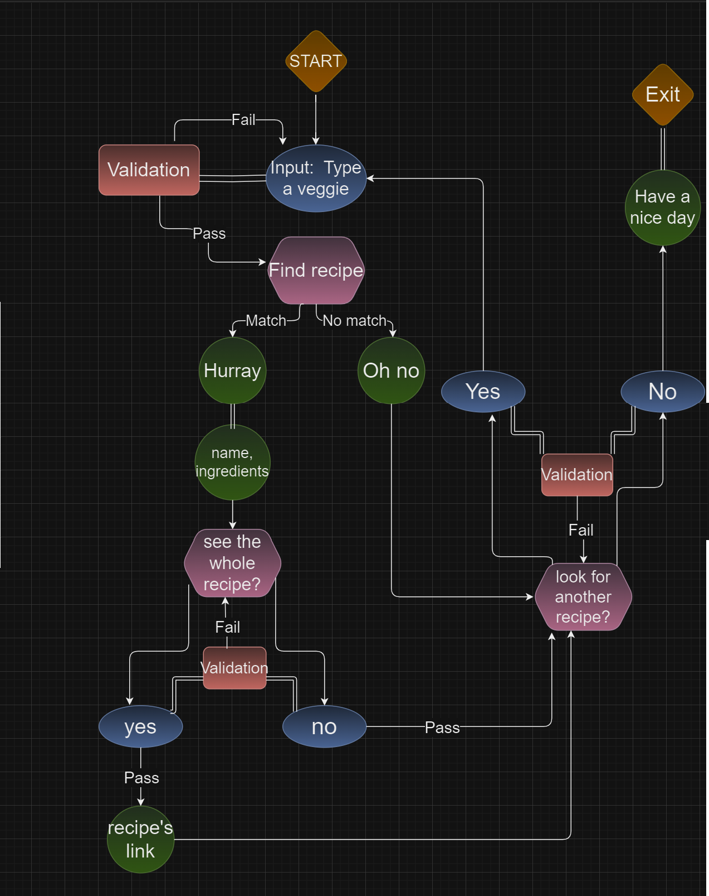

# Find Salad Recipes

[Live website link](https://find-salad-recipes-0da45bbd37f1.herokuapp.com/)

---

### Idea of the application

 - Original idea: Users write an ingredient that is in their fridge, so the program gives them recipes.
 - The goal is for the user to use up what they have, so save food, don't throw it out.
 
 
### Output and implemented idea:

 - But for this app, the "whole fridge" whould be too big a database, that needs a lot of time to create.
 - So I created the small version, where users choose a vegetable (I call it favorite, but of course what they have), and they get a recommended salad recipe.
 
 ### Future ideas:

In a future reboot I am concidering to add more options to choose from, and a function where the user can add their own recipe.
 
  
 
 ---
 ### Planning
 - I drew a diagram of what actions the functions trigger and the next step.
 - I also planned out in text form.

 
   
 
 ### Users need:
 - Easy text and questions, easy to understand and follow.
 - Error-handling, when their answer is incorrect, gives information about why, and gives another opportunity to correct it.
 - Browsing through cooking books or videos takes up too much time and energy, so this should be a quick opportunity to help inspire the user about that day's meal.
   Also, it saves money if they can use up the ingredients they already have.

  
 
### Follow through the app:

- Introduction - welcome text.

- The users are asked to type a vegetable - if it is not text, it throws an error, that they should write a text. Other characters are not allowed.

- Then the program loops through its database, to find if the desired veggie is matching with the ingredients of one of the recipes. Meanwhile, it lets the user know that it is loading while looking for recipes...

  - If there is a match, it says "Horray.."

  - It shows the recipe's name, and shows the other veggies that are needed. It asks the users if they want to see the whole recipe.

    - If they do want to see the whole recipe, it shows the link to the website where they can find it. Then the program asks, if they want to find another recipe or not.

      - If they do want to find another recipe, they can start adding a veggie again.

      - If they don't want to look for more recipes, the program says bye, and exits.

    - If the users choose that they don't want to see the recipe, they have the option to look for something else.

      - If they want to find another recipe, they can start adding a veggie again.

      - If they don't want to look for more recipes, the program says bye, and exits.

  - If there is no match for the recipe, It says "Oh no.. "

  - The program asks if they want to look for something else:

    - If they want to find another recipe, they can start adding a veggie again.

    - If they don't want to look for more recipes, the program says bye, and exits.

    

---
## Deployment

Creating GitHub repository: 
I. I used the Code Institute template for creating this project:
1. Open the repository of the template
2. Click on “Use this template”
3. Click on “Create a new repository”
4. Add your project’s name and keep it public
5. Click on “Create repository”
6. I clicked on "Code" in my repository, then “Open with GitHub Dekstop”.
7. From there I opened my project in VS Code.

II. Deploying on Heroku
1. Make sure my code is ready for deployment:
2. Add a new line at the end of every input
3. Update the requirement list - using this command in the terminal: “Pip3 freeze > requirements.txt”
4. Commit and push to GitHub

Log in to my Heroku account:
1. Click on “Create a new up”
2. Add my app’s name, and choose my region (Europe)
3. Click on “Create app”
4. From the menu, I choose “Settings”
5. Go to “Config Vars” section, and click on “Reveal Config Vars”
6. Type “CREDS” in the “KEY field” and copy my creds.json file content in the “VALUE field”, then click on “Add”
7. Go to “Buildpacks” section, click on “Add buildpack”
8. Select Python and click on “Save changes”
9. Click on “Add buildpack” again, select Node.js, and click on “Save changes”
10. From the menu choose “Deploy”
11. At the “Deployment method” select GitHub
12. At the “Connect to GitHub” section choose “Connect to GitHub”
13. Type my GitHub repository name and click on “Search”, then click on “Connect”
14. (Choose to have automatic or manual deployment - I chose manual)
15. Go to “Manual deploy” section and click on “Deploy branch”
16. Click on “View” - that shows the app

Deploy the edited project manually:
1. Refresh requirements.txt in the terminal
2. Commit and push to GitHub
3. Log in to the Heroku account
4. Click on your app’s name
5. Click on “Deploy” in the menu
6. Click on “Deploy branch” in the “Manual deploy” section

   

---
 

## Technology I used:
 
 - [GitHub](https://github.com/)
 - [GitHub Desktop]( https://desktop.github.com/)
 - [Heroku](https://dashboard.heroku.com/apps)
 - [Google Sheet](https://www.google.com/sheets/about/)
 - [VS Code](https://code.visualstudio.com/)
 - [Python Syntax Checker](https://extendsclass.com/python-tester.html)
 - [Colorama](https://pypi.org/project/colorama/)

 
**Libraries:**
- gspread
- Credentials from google.oauth2.service_account
- init, Fore, Style from colorama

 

---

 

## Process of coding, Errors and solutions

### Workflow

- I try out everything continuously. I was using print() for every new variable or function to try, and run the project every single time anything is added.
- I also wrote down which function triggers what, so I could compare how my code would follow, and where the error was.
- I made some variables global, so I could access them later.
- I defined all functions first. After them the app prints the starting messages and calls the functions.

 

_In the first paragraph I collected how functions should follow each other. In the second paragraph I wrote down how my actual program works, so I could figure out that the e.g. "Show the whole" function is not in place:_

  
 
_I also printed everything to the terminal to find the errors. E.g.:_

 

### Progress, errors, and solutions

### 1.
**Define how the program would work, and make a diagram.**

  

### 2.
**Set up API for google sheet**
 
 

_Creating google sheet doc:_

 

### 3.
**Set up Python**
- Integrated API, hid creds.json file

 

### 4.
**Install python libraries**

  

_Set up innitial libraries. I added Colorama only in the end::_

 
 

### 5.
**Validate_ingredients_sheet() function:**
- It calls the data from the ingredients work_sheet and puts it in a variable.
- If the sheet is not available, it throws an error message, that The 'ingredients' worksheet is not found in the spreadsheet.

 

### 6.
**ask_for_veggie() function:**
- Add presentation of the app before this function: "Are you craving some yummy salad? Tell me your favorite veggie, and I show you what you can make out of it.
- Add the favorite_veggie input with an example.

 

_starting print() and _ask_for_veggie()function:_

 

### 7.
**validate_favorite_veggie() function:**
 Make favorite_veggie input data valid:
- Make all the input lowercase
- I put ask_for_veggie() into a while loop, so when validation fails, it will ask again, until the input is correct.
- If the user writes anything silly that is not a veggie, then nothing happens, it is an ingredient that the program can not find.
 
  

 _validate_favourite_veggie_function:_

 

 
**- Error 1:**
 
validate_favourite_veggie() function was not working

**- Solution:**
 
validate_favorite_veggie() was inside the ask_for_veggie() function, I needed to take it out.
 
**- Error 2:**
 
Isistance, type(), didn't work.

**- Solution:**
 
I used isnumeric() first. But to handle special characters and empty spaces I changed it to not isalpha().

 

_Trying out with isnumeric() first if validation works_

 
 
**- Error 3:**
 
It was not validating again.

**- Solution:**
 
return was after the break, so I changed and now the break is after the return.
   
 

### 8.
**get_columns() function:**
- Creates column lists from the index of the rows.
  - Checks the length of the first row - that is the range it will loop through,
  - Then creates a column from all the rows with the same index-number values
  - Then put these lists into one big all_columns list
 
 

### 9.
**find_matching_recipe() function:**
- It checks if the given favorite_veggie input data is found in the database. Then with if-else function shows a message if data was found or not.
- (It was together with the show_matching_recipe() first, but I rather divided them into two functions.)
- For checking errors I printed all_ingredients - there were many empty cells. (I created an empty_table function, but at the end deleted it and chose to delete spaces within the show_matching_recipe() function) Also, it checks the rows - I want to check columns. -> I created get_columns() function.

 

_There is match:_

 

_There is no match:_

 
 
**- Error 1-2:**
 
When it loops through all the ingredients, it writes out many times if there is a match or not. Also, it says no match, when there is a match.

**- Solution:**

- There was no break. So when I added a break, it stopped after the first matching column. But if the first matching column was the 3rd, it wrote out 2 times no solution, then 3rd found it. So I added a pass instead of the break for no matches. But then I couldn't have the no-match message.  

- Then I noticed the columns were nested. The reason for the error is that it looped through the columns one by one. So it only looped through the first one, when it had a break. So I created flattened columns, which united all the separate column lists into one list, so the function could look through all the data. Now I could check if the input is in the list. So don't need to loop anymore, and I can add a message.

 

_Error, it says no match, many times:_

 

_Cause of many errors: nested list with empty values_

  

**- Error 3:**
   
For the case there was no matching recipe, I added the ask_for_veggies() function, but it didn't show anything
   
**- Solution:**
 
I created all_functions, where I put the whole sequence, and called that when the program needed to start again. I changed it later to the start_again() function.

- If there is a match, it triggers the show_recipe() function. If there is no match, it triggers the start_again() function.  
 
  

 _Creating all functions() function:_

 

### 10.
**Validate_link_sheet() function:**
- It calls the data from the link worksheet and puts it in a variable.
- If the sheet is not available, it throws an error message, that The 'link' worksheet is not found in the spreadsheet.

  

### 11.
**Show_matching_recipe function:**

- It writes the name and the rest of the ingredients of the matching recipe. It shows one recipe. - Future function: it shows all the matches, so the user can choose.
 
- My goal was to find which column has that ingredient. I used the enumerate() function first: I get the index numbers of the columns, so I can loop through find the favorite veggie in the list, and call it back.
I removed the enumerate function, because I did not need the index numbers.
         
_modified code:_

      for column in spaceless_columns:
         
_instead of:_

      for index, column in enumerate(spaceless_columns):
         num_list = f"{index} : {column}

  

 _Show_matching_recipe():

 
  

**- Error:**

some values are not found.

**- Solution:**

Remove empty values! : columns = [x for x in columns if x != ''] but it's not working. So I created a new list spaceless_columns. The values were not returning in the list, because I returned x directly back to spaceless_columns. Instead, I created a spaceless_column list too, returned x back to spaceless_column, and returned spaceless_column to spaceless_columns.
 
_-initial ideas for this function:_

- idea 1: define row first:
  Get the rows as a list.
  Then loop through rows: avocado, beetroot, pea pl.
  Then get avocados place: pl row-index 0.
  Then add+1 to get the column, since column numbers start from 1.

- idea 2, get columns as lists:[sallad1 ], [sallad2 ]  and loop through where avocado is. I used this idea. The function loops through the spaceless columns, checks in which recipe the favorite_veggie is, and then it breaks.  
  That is why it shows only one option. The column(list) where the veggie is found is a list with "normal" index numbers, so that I could call the name of the recipe with [0] and the rest of the ingredients with [1: ]
  In the future when I add the chose_recipe() function, I remove the break, so it shows all the options.
       
I reunited the find_matching_recipe() and show_matching recipe(), which was working the same fine, but I think it is better to have smaller functions, so I rather leave them separate.

  

### 12.
**show_the_whole_recipe function:**

-  The function asks the users if they want to see the whole recipe. The answer can be yes or no, with an if-elif statement the yes triggers the show_recipe_link() function, and the no triggers the start_again() function.
-  I get the values of the link sheet of my Google sheet (link_sheet) and call the values from it (all_links). Also, I called again the get_columns() function, to make columns, just with different arguments.
- I used the valide_answer() function, to check if the answer is anything else than yes or no. I used the same True expression as in the first ask_for_veggie function.
 
 

_show the whole recipe function and its validation:_

 

**- Error:**
 
Validation didn't work, it returned false always.

**- Solution:**
   
I used yes or no - I changed it to yes AND no

 

### 13.
**show_recipe_link:**

-  It loops through the link_sheet columns, and if there is a match with the name of the recipe, then it prints its link.
- When the user gets the recipe, it triggers the start_again() function.
             
  

_Show the link of the matching recipe:_

 
  

### 14.
**adding start again() function:**

 - It can have same yes-no answer, as in show_whole_recipe() function, with the same while True loop and validate_answer() function. When the user says yes, it replays all the functions all_functions(), if the answer is no, it wishes a nice day and exits the program.
 
  

 _Start again function with validation:_

 
  

**- Error 1:**
   
It exits but still shows the show_whole_recipe() function.

**- Solution:**

In the main sequence  show_matching_recipe() is later the find_matching_recipe() function. Find_matching_recipe() can trigger start_again(), and even if it exits the program, show_matching_recipe() would still be played. So I moved show_matching_recipe() into the find_matching__recipe, so it is only triggered by the user's answer.
             
**-  Error 2:**

If there are more matches, it plays through with the first match, exit, then it plays through with the second.

**- Solution:**

That was also fixed by getting flattened_list.

 

_Error: It plays through the sequence with all matches_

 

## Testing

| What to do                                                                                                         | How to do                                                               | Expected outcome                                                                                                                                                                                                                        | Actual Outcome                                                                                                                                                                                                                          |
| ------------------------------------------------------------------------------------------------------------------ | ----------------------------------------------------------------------- | --------------------------------------------------------------------------------------------------------------------------------------------------------------------------------------------------------------------------------------- | --------------------------------------------------------------------------------------------------------------------------------------------------------------------------------------------------------------------------------------- |
| Opening the app it has an initial message and shows the first input | Open the app | Are you craving some yummy salad? Tell your favorite veggie, and I show you what you can make out of it. Also it says Loading data... | Are you craving some yummy salad? Tell your favorite veggie, and I show you what you can make out of it. Also it says Loading data... |
| The ingredients worksheet is available | Start the app | The validate_ingredients_sheet() function doesn't throw error | The validate_ingredients_sheet() function doesn't throw error |
| Favorite_veggie input is working | Try to write in it | I can write | I can write |
| The validation is working | I try to write letters, numbers, and characters and hand them in empty | It throws an error message anytime except when I write letters: Numbers and characters are not acceptable | It throws an error message anytime except when I write letters: Numbers and characters are not acceptable | 
| The While loop is working for validating favorite_veggie: | I try to write letters, numbers, and characters and hand them in empty | It asks again and again to Type one vegetable. For example: tomato, the loop stops only when I write letters | It asks again and again to Type one vegetable. For example: tomato, the loop stops only when I write letters |
| The program makes favorite_veggie input lowercase | I write with capital letters, and print()the input to the terminal | It returns lowercase | It returns lowercase |
| It has a message that it is loading while looking for recipes | Submit my answer | It says I am looking for recipes… | It says I am looking for recipes… |
| There is a Hurray message if there is a match | Type a veggie that is in my database | It says: Hurray, I show your match! | It says: Hurray, I show your match! |
| The link worksheet is available | Run the app, until there is match | The validate_link_sheet() function doesn't throw error | The validate_link_sheet() function doesn't throw error |
| After the Hurray message it shows one recipe | Type a veggie that is in the database | It writes out the recipe's Name: and All the veggies you need: | It writes out the recipe's Name: and All the veggies you need: |
| All the veggies include favorite_veggie | Type a veggie that is in the database and compare it with the result | All the veggies you need also lists the one I was asking for in favorite_veggie input. | All the veggies you need also lists the one I was asking for in favorite_veggie input. |
| It asks if I want to check the whole recipe | Type a veggie that is in the database | After the recommended salad it asks, would you like to see the whole recipe? type yes or no | After the recommended salad it asks would you like to see the whole recipe? type yes or no |
| I can not type anything else than yes or no for recipe_answer | Type letters, characters, and numbers, and submit an empty value | It throws an error message that This question can only be answered with yes or no. | It throws an error message that This question can only be answered with yes or no. |
| The While loop is working for validating recipe_answer: | Type letters, characters, and numbers, and submit an empty value | It says, again and again, This question can only be answered with yes or no, and asks if I would like to see the whole recipe | It says, again and again, This question can only be answered with yes or no, and asks if I would like to see the whole recipe |
| It converts my Capitals into lowercase | I write yes/no with capitals, and print()the answer to the terminal | It returns them in lowercase | It returns them in lowercase |
| If I answer yes to show the whole recipe, it shows the link to the recipe | I type yes when it asks if I want to see the whole recipe | It says You can find the whole recipe on this link, and shows the link | It says You can find the whole recipe on this link, and shows the link |
| The link is working | I click on the link | The website is loaded, where the recipe for the salad can be found | The website is loaded, where the recipe for the salad can be found |
| It asks if I want to look for another recipe | I type yes when it asks if I want to see the whole recipe | After the link it asks, Would you like to look for another recipe? | After the link it asks, Would you like to look for another recipe? |
| I can not type anything else than yes or no for the start_again answer | Type letters, characters, and numbers, and submit an empty value | It throws an error message that This question can only be answered with yes or no. | It throws an error message that This question can only be answered with yes or no. |
| The While loop is working for validating start_again_answer: | Type letters, characters, and numbers, and submit an empty value | It says again and again This question can only be answered with yes or no. Would you like to look for another recipe? | It says again and again This question can only be answered with yes or no. Would you like to look for another recipe? |
| It converts my capitals into lowercase | I write yes/no with capitals, and print()the answer to the terminal | It returns them in lowercase | It returns them in lowercase |
| If I type yes to look for another recipe, the sequence starts again | I answered yes to the question, Would you like to look for another recipe? | It says Type a vegetable. For example: tomato, and I can type my veggie | It says Type a vegetable. For example: tomato, and I can type my veggie| | If I type no to look for another recipe, the program exits | I answer no to the question Would you like to look for another recipe? | It says: Have a nice day | It says: Have a nice day |
| If I type no to show the whole recipe, it asks if I want to look for another recipe | I type no when it asks, Would you like to look for another recipe? | It says Would you like to look for another recipe? Type yes or no| It says Would you like to look for another recipe? Type yes or no | 
| If there is no match with the veggie_inout it says oh no | To the favorite_veggie input, I answer something out of the database | It says: Oh no, I haven't found any recipes unfortunately | It says: Oh no, I haven't found any recipes unfortunately |
| After sending Oh no message it asks if I want to look for another recipe | To the favorite_veggie input, I answer something out of the database | After Oh, no message it says Would you like to look for another recipe? Type yes or no. | After Oh, no message it says Would you like to look for another recipe? Type yes or no.| 
| The sequence can go on "forever" | I am playing through the sequence many times without answering no to look for more recipe questions | It is working, playing everything again and again | It is working, playing everything again and again | 
| Validation shows no error | I copied my code to [Python Syntax Checker](https://extendsclass.com/python-tester.html) | It says no syntax error detected | It says no syntax error detected | 

 

_Python validation:_

 

### Optimization:

- I had functions for validating yes-no answers, I refactored them into one, and I used it with different arguments. I also reused the get_columns function with different arguments.
 
- Making expressions shorter

1.      spaceless_column=[]
        for x in column:
          if x.strip() != '':
            spaceless_column.append(x)
       
         => spaceless_column=[x for x in column if x.strip() != '']

2.        columns = []
          for row in sheet:
            columns.append(row[columns_index])

          => columns = [row[columns_index] for row in sheet]

 

- I made all input answers lowercase, so it eliminates the error that it doesn't find a match due to an uppercase letter, also the Recipe names are uppercase, so it eliminates the issue of pairing up with the recipe name instead of ingredients.

- I gave relevant names for everything to make the code easy to follow

- Have an example.json file, which helps to recreate the project but doesn't contain sensitive data.

- I added if __ name __ == "__ main __" before I call all_functions(), so it doesn't run automatically, only when I directly want to execute it. 

- To make it more readable and friendlier I used Colorama and also inserted some emojis.

  - type to the terminal: pip colorama install
	- colorama.just_fix_windows_console()
  - then import it to the file: from colorama import init, Fore, Style
  - call it once with init()
  - Then I used the documentation to find colors and inserted in my text. {Fore.COLOR}, {Style.RESET_ALL}

 

_colorama and emojis:_

 

**- Error:**
- Altough on my terminal the colors were nice, on the deployed version it was too dark.

**- Solution:**
 I added {style.BRIGHT} also in front of my colors.

 

_Too dark:_

 

_Corrected the colors, now it is perfect:_

 

---

  

## Credits:  

**1. I learned some code snippets:**

- Getting columns from rows:

[Python.org](https://docs.python.org/3/tutorial/datastructures.html#list-comprehensions)

- Making a flattened list:

[Io flood](https://ioflood.com/blog/python-flatten-list-how-to-flatted-nested-lists-in-python/)
   
- Making string from the list:
 
[Simpli learn](https://www.simplilearn.com/tutorials/python-tutorial/list-to-string-in-python)

- SpreadSheet Not Found:
 
[Docs.gspread](https://docs.gspread.org/en/latest/api/exceptions.html#gspread.exceptions.SpreadsheetNotFound)

**2. All the amazing recipes:**

- [Love and lemons](https://www.loveandlemons.com/salad-recipes/)

Special thanks to Code Institute and my mentor Ronan McClelland for reviewing, helping and answering all my questions, and Máté Godár who helped me solving technical issues, so I could start my project. 

